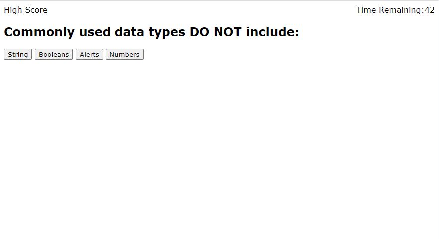

# Homework4-CodeQuiz
Homework 4 due 9/22/2021: Code Quiz.

Description: This web application provides a timed JavaScript fundamentals quiz that stores multiple high scores in the browser's local storage. The stored scores will allow users to compare their understanding with other classmates. This web application utilizes also utilizes event listeners, time intervals and APIs.

Completed Web App Screenshot: 

Link to deployed application: https://calvinswomley.github.io/Homework4-CodeQuiz/

